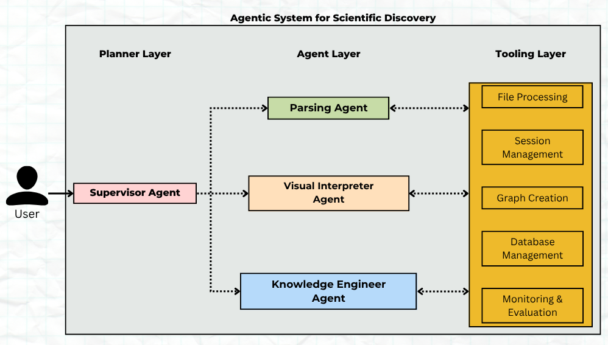

# Agentic AI Enhances Deep Scientific Research via Multi-Agent Coordination

## Authors & Affiliations

- Daniela Patricia Cheng Rodriguez, Universidad Católica Santa María La Antigua
- Faith Wangui Njoroge, Strathmore University 
- Wesley McGinn, University of Michigan 
- Job Ian Onyango, Strathmore University  
- Samuel Rund, Professor, University of Notre Dame  
- Andrey Kuehlkamp, Professor, University of Notre Dame  
- Don Brower, Researcher, University of Notre Dame 
- RADlings, Center for Research Computing (CRC), University of Notre Dame

---

## Abstract

This work investigates how Agentic AI systems can augment and potentially transform deep scientific research. We began by modeling the cognitive workflows that human researchers follow when conducting complex investigations. This conceptual framework informed the development of a computational analog: a multi-agent AI system designed to reason, plan, and execute domain-specific tasks.

The system architecture uses a supervisor-worker pattern, where a foundational model (GPT) acts as the supervisory agent. This agent interprets user prompts, performs high-level reasoning, and orchestrates workflows by delegating tasks to specialized worker agents. For this study, we integrated two domain-specialized models: Smoldocling, optimized for document parsing, and Gemini, adept at chart extraction.

The hybrid system was evaluated against individual models performing the same tasks in isolation. Our findings indicate that the agentic framework significantly improves document ingestion accuracy, coherence of extracted information, and overall processing efficiency. These results suggest that multi-agent configurations leveraging both foundational and specialized models can more effectively tackle the multifaceted nature of scientific research.

This outcome supports the viability of building a scalable, Agentic AI system capable of contributing to—and accelerating—deep scientific discovery. Ongoing work will extend this framework across broader domains and integrate more sophisticated orchestration mechanisms.

---

## What We Did

- **Modeled cognitive workflows** commonly employed in deep scientific research to guide system design.

- **Developed the Parsing Agent**, built on the Smoldocling model. It accepts document files, user prompts, and page numbers as input, and returns a structured *Docling Document* containing parsed text and layout metadata. Hosted the Smoldocling model on a GPU server for better performance and built an API for the agent to communicate through.

- **Created the Visual Interpreter Agent**, powered by the Gemini model. It processes document files and user prompts to extract and summarize visual content such as charts. It also performs *self-reflection* by overlaying extracted visuals onto the original charts to evaluate and refine its output.

- **Implemented a modular multi-agent framework** based on the *supervisor-worker* pattern, enabling flexible orchestration of specialized agents.

- **Integrated GPT-4o as the Supervisory Agent**, responsible for interpreting user intent, generating high-level plans, and managing execution. It monitors the performance of worker agents and provides feedback loops for task refinement and error correction.

- **Benchmarked system performance** against standalone models executing the same tasks independently.

- **Validated improvements in research document understanding**, showing higher accuracy, better coherence of extracted content, and more robust multi-step task execution within scientific workflows.

---

## Future Vision

We envision a full-scale Agentic AI Research Assistant system with the following capabilities:

- **Integrated knowledge graphs** and memory for structured reasoning across long contexts.
- **Extended agent ecosystem** for tasks like literature gap analysis, hypothesis formulation, and data synthesis.
- **Interactive research environment** where scientists can collaborate with AI via a web-based interface.
- **Plug-and-play deployment** for labs and research centers with flexible APIs and modular components.

Ultimately, our goal is to co-design future scientific workflows where Agentic AI becomes a trusted collaborator in pushing the boundaries of discovery.

